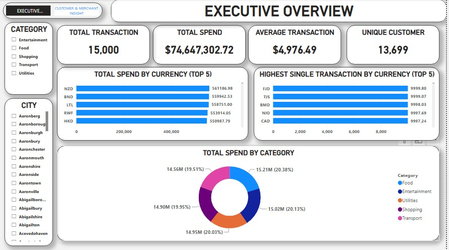

# 💸 Financial Transactions: Customer & Merchant Insight

**Prepared by:** Ubong Solomon

---

## 1. Introduction

Understanding how customers spend, where they spend, and how concentrated that spending is across merchants and currencies is central to payments strategy, merchant partnerships, and risk monitoring. This project analyzes a financial transactions dataset through an interactive Power BI dashboard, converting raw transaction records into insights that support management decisions on customer retention, merchant relationships, and spend monitoring.

The goal of this report is to summarize the dashboard's findings in a structured format for management review, and to translate the numbers into clear, actionable recommendations.

---

## 2. Data Description

The dataset underlying this dashboard covers individual financial transaction records. Each record includes:

| Field | Description |
|---|---|
| Transaction ID | Unique identifier per transaction |
| Customer | Customer who made the transaction |
| Merchant | Merchant that received the payment |
| Category | Entertainment, Food, Shopping, Transport, Utilities |
| City | City where the transaction took place |
| Currency | Currency of the transaction (many currencies, e.g. NZD, BND, HKD, CAD) |
| Amount | Transaction amount |

**Scope:** 15,000 transactions from 13,699 unique customers and 12,523 merchants, filterable by Category and City, across two dashboard pages (Executive Overview, Customer & Merchant Insight).

---

## 3. Methodology

The analysis followed these steps:

1. **Data consolidation** – Transaction, customer, merchant, and currency records were combined into a single structured table.
2. **Data cleaning** – Records were checked for missing values, consistent category, city, and currency naming, and duplicate transactions.
3. **Aggregation** – Transaction counts and amounts were aggregated by category, currency, merchant, and customer.
4. **Visualization** – Aggregated measures were built into a 2-page interactive Power BI dashboard using KPI cards, bar charts, a donut chart, and a category-by-currency matrix table, with slicers for Category and City.
5. **Interpretation** – Patterns in the visualized data were reviewed to identify spend concentration, repeat behaviour, and areas warranting management attention.

**Tool used:** Power BI Desktop

---

## 4. Analysis and Findings 

### 4.1 Overall Performance

| Metric | Value |
|---|---|
| Total Transactions | **15,000** |
| Total Spend | **$74,647,302.72** |
| Average Transaction | **$4,976.49** |
| Unique Customers | **13,699** |
| Total Merchants | **12,523** |
| Average Spend per Customer | **$5,449.11** |
| Highest Single Transaction | **$9,999.80** |

These figures reconcile with one another: $74.65M ÷ 15,000 transactions ≈ $4,976 per transaction, and $74.65M ÷ 13,699 customers ≈ $5,449 per customer.

### 4.2 Total Spend by Category

| Category | Spend | Share |
|---|---|---|
| Food | $15.21M | 20.38% |
| Entertainment | $15.02M | 20.13% |
| Utilities | $14.95M | 20.03% |
| Shopping | $14.90M | 19.95% |
| Transport | $14.56M | 19.51% |

Spend is spread almost evenly across the five categories — the gap between the largest (Food) and smallest (Transport) is less than one percentage point.

### 4.3 Total Spend by Currency (Top 5)
- NZD: **561,186.98**
- BND: **559,942.53**
- LTL: **558,751.00**
- RWF: **553,914.05**
- HKD: **550,987.79**

The top five currencies sit within about 2% of each other, so no single currency dominates spend.

### 4.4 Highest Single Transaction by Currency (Top 5)
- FJD: **9,999.80**
- TJS: **9,999.07**
- BMD: **9,998.03**
- NIO: **9,997.69**
- CAD: **9,997.24**

Every top single transaction lands just under 10,000, which suggests transaction amounts run up to a ceiling of roughly 10,000.

### 4.5 Top 10 Merchants by Total Amount
- Zuniga Group: **13K**
- Zimmerman PLC: **13K**
- Zuniga PLC: **11K**
- Zimmerman-Murphy: **9K**
- Zuniga Inc: **8K**
- Zimmerman-Armstrong: **7K**
- Zuniga, Wagner and Wagner: **5K**
- Zimmerman-Huerta: **3K**
- Zimmerman-Hall: **1K**
- Zimmerman-Holmes: **~0K**

Even the largest merchant (13K) represents a tiny fraction of the $74.65M total — merchant spend is highly fragmented.

### 4.6 Top 10 Customers by Total Amount
- Zachary Young: **9K**
- Zoe Hancock: **8K**
- Zoe Jackson: **7K**
- Zachary Williams: **6K**
- Zoe Carter: **5K**
- Zachary Thomas: **4K**
- Zoe Diaz: **3K**
- Zachary Webb: **3K**
- Zachary Thoma…: **1K**
- Zachary Walker: **1K**

The largest customer (9K) spends only about 1.7x the average customer ($5,449), so there is no heavy customer concentration.

### 4.7 Spending by Category and Currency (partial view)
The matrix on the dashboard shows only the first 13 currencies (AED to BDT). Within that view:
- The largest single cell is **Entertainment in AED (176,917.79)**.
- **AOA** has the highest currency total (**521,572.22**); **ARS** (349,979.22) and **AFN** (353,338.60) have the lowest.
- The leading category differs by currency — for example Entertainment leads in AED, Food in BAM, and Transport in AOA — so category preference is not uniform across currencies.

---

## 5. Key Insight

- **Spend is evenly balanced across categories.** All five categories fall between 19.5% and 20.4% of total spend, so no single category is a dependency.
- **There is very little repeat activity.** 15,000 transactions across 13,699 customers is only about 1.1 transactions per customer, and 12,523 merchants means about 1.2 transactions per merchant — most relationships appear to be one-off.
- **Concentration risk is low.** The top merchant (13K) and top customer (9K) are a tiny share of $74.65M total spend.
- **Transaction amounts appear capped near 10,000**, with an average of $4,976 sitting almost exactly at the midpoint — amounts look evenly spread across the range rather than clustered around a typical purchase size.
- **No single currency dominates.** The top five currencies by spend are within roughly 2% of each other.

**Data note:** Total Spend is shown in dollars, but the underlying amounts are recorded across many currencies. It should be confirmed whether amounts were converted to a single currency before being summed; if not, the headline totals mix currency units.

---

## 6. Recommendation

1. **Build a repeat-customer strategy.** With roughly 1.1 transactions per customer, loyalty offers, follow-up campaigns, or rewards could lift repeat activity from a very low base.
2. **Deepen relationships with merchants.** Since merchant spend is fragmented, prioritise the largest merchants (Zuniga Group, Zimmerman PLC, Zuniga PLC) for partnership programmes while exploring ways to bring merchants back for repeat volume.
3. **Confirm currency handling in the totals.** Verify that amounts are converted to one reporting currency before aggregation, and label the KPI with the currency used.
4. **Investigate the roughly 10,000 ceiling on transaction amounts.** Confirm whether it reflects a real limit (for example a product or policy cap) or a data-capture issue.
5. **Extend the category-by-currency matrix beyond the first 13 currencies.** Making the full table available would allow category preferences to be compared across all currencies.
6. **Monitor category mix for shifts.** With an even spread today, changes in any one category would be an early signal of changing customer behaviour.

---

## 7. Conclusion

Across 15,000 transactions totalling $74.65M from 13,699 customers and 12,523 merchants, spend is remarkably balanced — evenly split across categories, spread across many currencies, and fragmented across merchants and customers, which keeps concentration risk low. The flip side is that most customers and merchants appear only once in the data, pointing to repeat engagement as the main growth opportunity. Two points deserve confirmation before the figures are relied on for decisions: how multiple currencies were handled in the total spend, and why transaction amounts top out just below 10,000. Acting on the recommendations in this report can help management strengthen retention, deepen merchant relationships, and keep spend reporting reliable going forward.

---

**Prepared by:** Ubong Solomon
